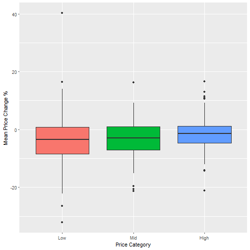
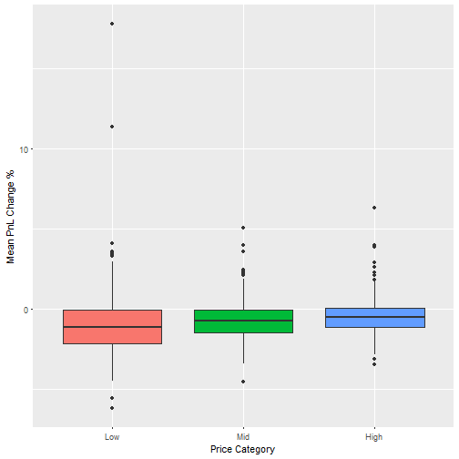

TSX Stock Analysis for 2015
========================================================
author: Nicolaas Kuit
date: 23-Jun-2017
autosize: true

Buy lower vs higher priced stocks?
========================================================

- We'll look at the daily close prices of 339 TSX securities from Jan 1, 2015 - Dec 31, 2015.
    + Each security has prices for the entire year, and belonged to an index at that time.

- *Question 1*: Is there a difference in PnL % terms between low and high priced stocks?
- *Question 2*: With a Simple Moving Average (SMA), long only algorithm, is there a difference in PnL % terms between low and high priced stocks?

Profit & Loss % (PnL) for low & high priced stocks
========================================================
left: 60%
<small>
- Buy the stock at each day, and sell it **50 days later**, for all days of the year.
- The average PnL % is calculated for each of these trades, for each stock.
- Based on the average starting (buy) price, each stock is categorized into low/mid/high.
</small>

<small>
T-Test between price change % of Low and High starting prices:
</small>

<small>
p-value: 0.054808 > 0.05, so we **can not** say that there is a difference between Low and High priced stocks.
</small>

***

Simple Algorithm: PnL % between low vs high priced stocks?
========================================================
left: 60%

<small>
- Buys when the price is above SMA, & sell next time the price is below the SMA.
- The average PnL % is calculated for each stock.
- Price category from previous slide is used.
</small>
      

<small>
T-Test between PnL % of Low and High starting prices:
</small>

<small>
p-value: 0.3486684 > 0.05, so we **can not** say that there is a difference between Low & High priced stocks.
</small>

***

Conclusions
========================================================
- We can only generalize about 2015.
- For the T-test, we have to assume the price and PnL percentages are normally distributed.
- The TSX market in general was in a downward trend for the entire 2015, so it makes sense that the PnL in the SMA strategy is negative.

- Based on the data analysed, there is **no difference** between buying **lower** priced stocks versus buying **higher** priced stocks.
